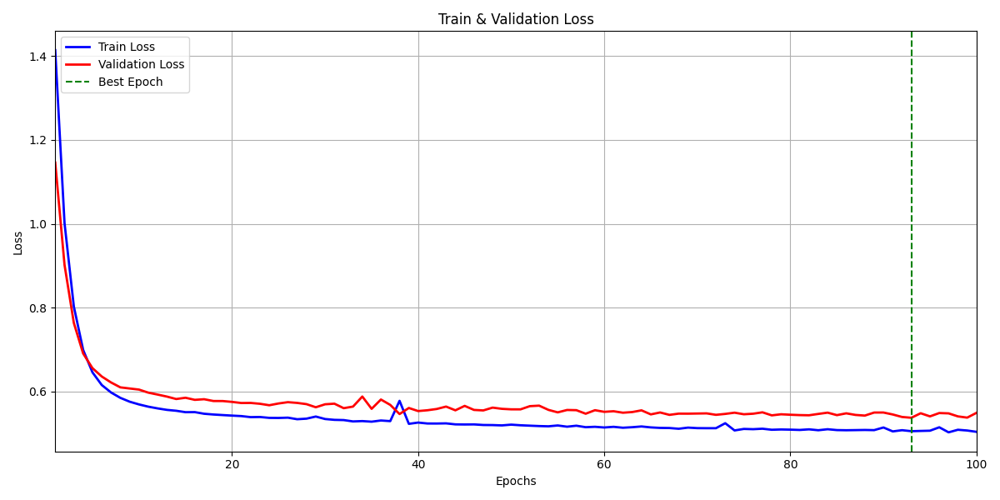
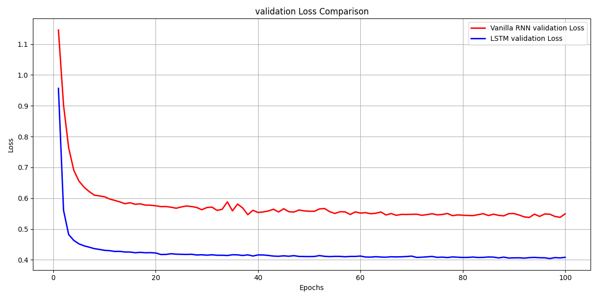

# Shakespeare Language Model
Text generation model(CharRNN, CharLSTM)

## Setups
- numpy : 1.26.0
- Python : 3.9.18
- pytorch : 2.1.1

## Experiment Setting
- epoch : 100
- batch_size : 128
- optimizer : AdamW (to prevent overfitting)
- lr : 0.001 
- embedding dim : 128
- RNN, LSTM num_layers : 2
- hidden_size : 512

## File description
- main.py : for train(+ option: text generation)
- generate.py : for text generation
- model.py : model definition
- dataset.py : Shakespeare dataset & dataloader

## Run

```
python main.py
```

## The average loss values for training and validation
- RNN


- LSTM
 

- RNN vs LSTM 


- RNN val loss > LSTM val loss
- RNN보다 LSTM이 더 자연스러운 텍스트를 생성할 것으로 기대됨.

## Text Generation Performance in different temperature
- Temperature에 따른 RNN과 LSTM의 텍스트 생성 능력 확인
- RNN, LSTM best validation performance를 보인 모델을 사용
- Seed characters example
    - 'QUEEN: So, lets end this'
    - 'Lord: Kill him!'
    - 'Citizen: I have a bad news.'
    - 'Princess: I love you'
    - 'All: Wow'

#### Seed characters : "QUEEN: So, lets end this
#### Temperature : 0.1
**RNN text generation**
```
QUEEN: So, lets end this
, to all our harts.

BUCKINGHAM:
Who, I, my lord I we know each other's throat,
And waked you not with this sore agony?

CLARENCE:
O, no, my dream was lengthen'd after our comploy'd by him, I would not have been much before
You'll speak agreed
Therein behold the same to see him buried.
God grant tha

```
**LSTM text generation**
```
QUEEN: So, lets end this
 business.

BRUTUS:
Not unlike,
Each way, to better yours.

CORIOLANUS:
Why then should I be consul? By yond clouds,
Let me deserve so ill as you, and make me
Your fellow tribune.

SICINIUS:
You show to't.

MENENIUS:
You have told them home;
And, by my troth, you have cause. You'll sup with me?

VOL
```

#### Temperature : 0.5
**RNN text generation**
```
QUEEN: So, lets end this
, to all our cares fears; which will in the people!

All Citizens:
True,
The hire of our happy day.

GLOUCESTER:
Villains, set down the corse.

GLOUCESTER:
The fitter for that will from them?

DUCHESS OF YORK:
What stays had I but they? and they are gone.

QUEEN ELIZABETH:
God grant that some, less 
```
- 다소 단편적인 느낌. 대화 사이의 연결이 명확하지 않음.

**LSTM text generation**
```
QUEEN: So, lets end this
 king,
And watery moon,
May send forth plenteous tears to drown the world!
Oh for my husband, for my dear lord Edward!

GLOUCESTER:
Ha!

QUEEN MARGARET:
I call thee not.

GLOUCESTER:
I cry thee mercy then, for I had thought
That thou hadst call'd me all these bitter names.

QUEEN MARGARET:
Why, so I
```
- RNN이 생성한 텍스트에 비해, 인물 간의 대화가 자연스러워보임
#### Temperature : 1.5
**RNN text generation**
```
QUEEN: So, lets end this
 unheart courts all things should wnow he been a rod to her friends; nay, let them follow: but sturn!

AUFIDIUS:
My noble masters! have I do't,
Lest I surcease to honour more voices boing by rather
Than I doubt; for your trial of mine?

TYRREL:
Awisin, my Lord of Derby women:
But you, my noble accep
```
**LSTM text generation**
```
Seed: QUEEN: So, lets end this
 hour at Baynard's Castle.
Now will I in, to take some privy order,
To draw the brats of Clarence out of sight;
And to give not indeed loved
the common people.

BRUTUS:
Mark you that?

CORIOLANUS:
To brag unto them, thus I did, and thus;
Show them the unaching scars which I should hide,
As if I had 
```
- RNN, LSTM 모두 텍스트 생성이 불안정해짐. 다양한 텍스트를 생성하면서, 오히려 문맥과 상관없는 텍스트를 생성하는 경향을 보임

#### 생성된 결과에 대한 분석
- RNN보다 LSTM이 생성한 text가 문법적으로 정확하고 정돈된 문장 구조를 보임
- 또한, LSTM이 인물 간의 대화가 더 자연스럽게 이루어짐
- Temperature가 높을수록 텍스트의 다양성이 증가함을 확인 가능
- 하지만, 다양성이 증가함에 따라, 두 모델 모두 대화가 부자연스러워지는 경향이 있음

#### Temperature가 높을수록 다양성과 창의성이 증가하는 이유
- **Temperature가 높아질수록**, Softmax의 출력이 더 완만해져 덜 선택될 수 있던 character를 선택될 확률이 높아짐.
- 따라서, 높을수록 다양하고 예측하기 어려운 텍스트를 생성함.
- 반대로, **Temperature가 낮을수록**, Softmax의 출력에서 높은 출력을 보이는 logit값이 더 강조되는, 분포가 뾰족해지는 특징이 있음.
- 따라서, 낮을수록 예측 가능하고 일관된 텍스트를 생성함.
